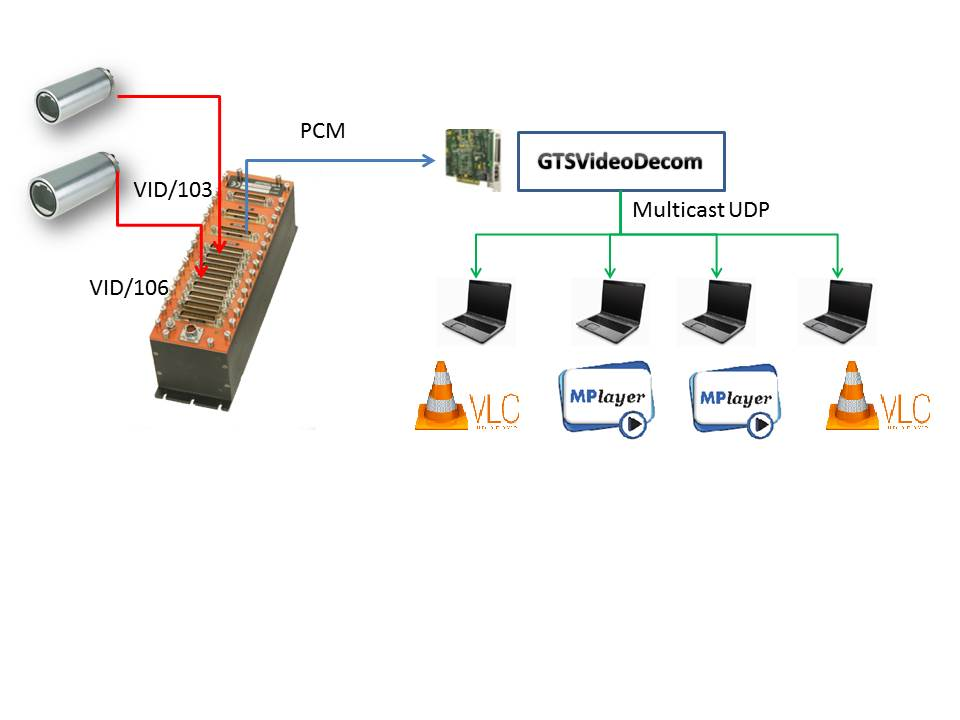
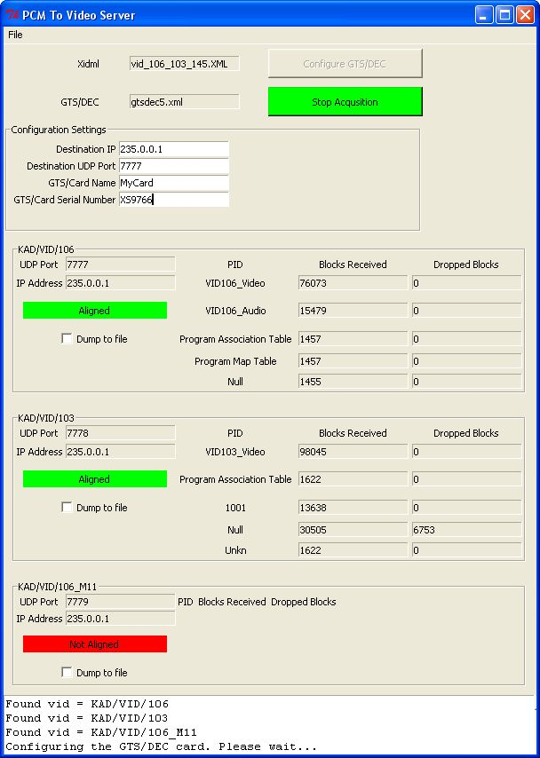

GTSVideoDecom
=============

GTS/DEC to Video Debug

#Introduction#
GTSVideoDecom is a PCM to Video bridge based around the [GTS/DEC](http://www.cwc-ae.com/product/gtsdec005) card. It allows a user to decom a
PCM stream from a PCM transmitter such as a [BCU/101](http://www.cwc-ae.com/product/kadbcu101) or [ENC/106](http://www.cwc-ae.com/product/kadenc106), take out all the video words in the
frame and reconstruct and transmit the MPEG Transport Stream back out over UDP. Multiple video instruments
in the one frame are supported

Off the shelf video players such as VLC or mplayer can play back this video stream on standard computers



##Requirements##
* Windows XP or Windows 7
* [GTS/DEC decom card](http://www.cwc-ae.com/product/gtsdec005) with the SDK installed
* Python 2.7

##Install##
Clone this repo to a local directory
```
git clone https://github.com/diarmuidcwc/GTSVideoDecom.git
```

##Inputs to Application##
* xidml source file from KSM or DASStudio. This file defines the instruments and the PCM frames
* xml configuration for the GTS/DEC. This file configures the GTS/DEC instrument. Sample files are in the Configuration directory

##GUI Application##
To run the GUI version of the tool run
```
python gVPCMToVideo.py
```
You will be presented with a basic window with a number of visible configuration settings. Setup the configuration
settings as you want. The default IP and UDP settings are usually ok.
The GTS/DEC settings should match the GTS/DEC card in your GTS/DEC xml configuration file (above)

Now load your xidml source file from KSM or DasStudio and the GTS/DEC xml file using the "File" menu.

Once you load these files, the application should list all the VIDEO instruments it found in the source xidml and
it will report the destination IP and UDP port that the UDP Mpeg stream will be broadcast

Now configure the GTS/DEC card by clicking "Configure GTS/DEC". If this complete successfully, you will see the following
message in the console
```
Configuring the GTS/DEC card. Please wait...
Successfully programmed GTS/DEC card
```

At this point the "Run Acquistion" button should be available. Click on this button

Now the application will attempt to acquire data, extract all the video words it finds, align the data so that the
sync word is aligned to the first word in the UDP payload and transmit the aligned data.



###The diagnostics output###
The GUI reports some diagnostic information about the video stream. It reports the various Program IDentifiers in the
stream. Typically there will be video, audio, PAT,PMT and null packets. If you are seeing a high number of null packets
then most likely you are over sampling the video instrument and wasting some PCM bandwidth. If you are not seeing any
null packets then you are undersampling the instrument and missing some data

You also have the option to dump the transport stream to a file by clicking on the checkbutton

Typically there should be no dropped packets on any PID, however I have noticed some null packets being reported as
lost on the VID/103. To be investigated

##Command Line Application##
To run the command line version of the tool run
```
python VideoOverPCM_To_UDP.py  --gtsdec <gtsdec.xml> --xidml <taskfile.xidml>
```

The output is very simple. The application will configure the GTS/DEC card, read the task file, identify all the VIDEO
instruments, and then bridge the PCM source frames to multiple UDP streams

The application will constantly try to keep the video words aligned

##Configuration##
A number of configuration options for the tool can be set and stored in the gtsdecom.ini file. this applies to both the
command line and the GUI

##Playback##
This application generates a single UDP stream per video instruments. The application will
report the destination IP Address and UDP Port for each stream. To playback these streams, run
[VLC](http://www.videolan.org/vlc/download-windows.html) or [mplayer] (http://www.mplayerhq.hu/design7/dload.html)as follows.
```
vlc udp://@235.0.0.1:7777
mplayer udp://@235.0.0.1:7777
```

To minimise the latency of the video playback the ideal application is mplayer with the following command line options
```
-benchmark
-nosound
```

The latency on vlc can be reduced but it does not seem to perform as well as mplayer due to internal caching of data.


